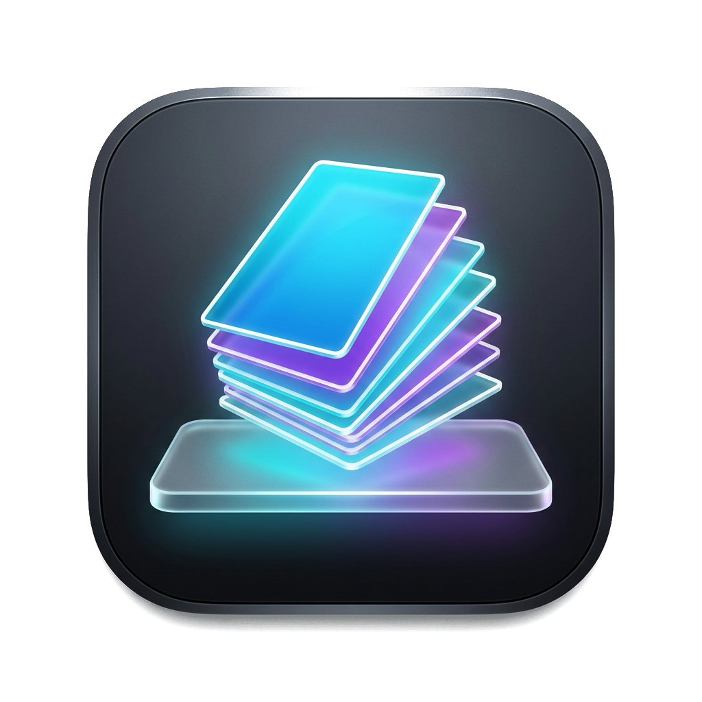
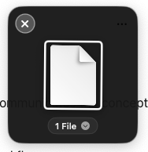

<div align="center">
<br/>

# DragShelf

**A lightweight, floating temporary shelf for drag-and-drop on macOS.**  
*Shake your cursor while dragging files to summon a floating shelf, stash items from multiple places, and drag them all out together.*

<br/>

<a href="https://github.com/henrynvn09/dragshelf"></a>
<a href="https://github.com/henrynvn09/dragshelf"></a>
<a href="https://github.com/henrynvn09/dragshelf/releases"></a>
<a href="https://github.com/henrynvn09/dragshelf/blob/main/LICENSE"></a>

<br/><br/>

<video src=".github/demo.mp4" controls="controls" muted="muted" playsinline="playsinline" width="600" poster=".github/screenshot.png">
  <source src=".github/demo.mp4" type="video/mp4">
  
</video>
<br/>
<p><sub><em>🎥 Shake to summon, drop items, and drag stack out all together.</em></sub></p>

</div>

<hr/>

## Overview

Dragging files across multiple Finder windows, full-screen apps, or desktop spaces on macOS can be clumsy. **DragShelf** provides a quick staging area right at your fingertips:

1. **Pick up** any files or web images.
2. **Shake** your cursor — a compact dark shelf appears immediately under your pointer.
3. **Drop** the items onto the shelf.
4. Navigate comfortably to your destination and **drag the stack out** to drop everything at once.

---

## Major Features

- 🖱️ **Shake to Summon**: Detects deliberate cursor wiggling while dragging files. Includes hardware pasteboard gating to completely ignore casual clicks and Finder marquee selection boxes.
- 🗂️ **Authentic Card Stack UI**: Displays collected files as a physical, overlapping photo stack with clean white borders, drop shadows, and QuickLook thumbnail previews.
- 📦 **Batch Drag-Out**: Click and drag the center card stack to seamlessly drop all staged items into Finder, Desktop, Mail, or any external application. The shelf automatically dismisses upon completion.
- 🛡️ **Self-Drop Protection**: Dragging items back over the shelf or cancelling a drag will never swallow or clear your files — items remain safely staged on the shelf.
- 🚫 **Duplicate Prevention**: Dropping identical files or URLs will not create duplicates or increment the badge count.
- ✋ **Draggable Shelf**: Click and hold anywhere on the shelf card background to smoothly move the window across your screens (shows an interactive `✋` hand cursor).
- ⚡ **Built-In Actions Menu**:
  - **Open with Preview**: Quick Look multi-item preview.
  - **Show in Finder**: Instantly reveal the staged files.
  - **Batch Operations**: Compress to ZIP, OCR text recognition, image format conversion (PNG/JPEG), and metadata stripping.
  - **Share & Copy**: Native macOS Share sheet integration and one-click path copying.
- 🪶 **Lightweight & Private**: Zero cloud dependencies, zero analytics, menu-bar accessory mode only (`LSUIElement`).

---

## How to Use

| Action | Gesture / Step |
| :--- | :--- |
| **Summon Shelf** | Drag any file(s) and wiggle your cursor back and forth quickly. |
| **Stage Items** | Drop files, images, links, or text clippings onto the shelf card. |
| **Move the Shelf** | Click and drag anywhere on the black card background or top bar. |
| **Pull Files Out** | Click and drag the center card stack into Finder or another application. |
| **Quick Look** | Click the bottom count capsule badge (e.g. `3 Files ⌵`). |
| **Actions Menu** | Click the `...` button on the top right. |
| **Dismiss Shelf** | Click the `✕` button on the top left. |

---

## System Requirements & Permissions

- **macOS 14.0 Sonoma** or later (Apple Silicon & Intel supported).
- **Accessibility Permission**: Required for global cursor drag and shake detection.
  - When you first launch the app, macOS will prompt you to grant Accessibility access under:  
    `System Settings` → `Privacy & Security` → `Accessibility` → Enable **DragShelf**.

## Installation (For All Users)

### Option 1: Direct Download (DMG or ZIP)

1. **Download the latest release**:
   - Download [`DragShelf-v1.0.0.dmg`](https://github.com/henrynvn09/dragshelf/releases/latest) or [`DragShelf-v1.0.0.zip`](https://github.com/henrynvn09/dragshelf/releases/latest).
2. **Install**:
   - Open the `.dmg` disk image and drag **DragShelf** to your **Applications** folder.
   - *(If downloading `.zip`, double-click to expand and move `DragShelf.app` to Applications).*
3. **Open the App (First-Time Gatekeeper Note)**:
   - Because DragShelf is an independent open-source project without a paid Apple Developer certificate, macOS Gatekeeper may show a warning on first launch.
   - **Right-click (or Control-click)** `DragShelf` in your Applications folder and click **Open**, then click **Open** in the confirmation popup.
   - *Alternatively*: Go to **System Settings** → **Privacy & Security**, scroll down to the Security section, and click **Open Anyway**.
4. **Enable Accessibility Permission**:
   - DragShelf requires Accessibility access to detect mouse drag shakes across apps.
   - When prompted, click **Open System Settings** (or navigate to **System Settings** → **Privacy & Security** → **Accessibility**).
   - Toggle the switch next to **DragShelf** to **ON**.
5. **You're all set!**
   - Pick up any file or image, shake your cursor back and forth, and stash your items.

---

## Building from Source (For Developers)

Build and package the app using the standard Swift Package Manager:

```bash
# 1. Clone the repository
git clone https://github.com/henrynvn09/dragshelf.git
cd dragshelf

# 2. Compile debug or release binary
swift build -c release

# 3. Copy binary into app bundle (or run directly)
.build/release/DragShelf
```

---

## Architecture

- **`EventTapManager` & `ShakeDetector`**: High-frequency hardware cursor monitoring with pasteboard verification to guarantee zero false triggers during regular window clicks or text selection.
- **`ShelfPanel` & `ShelfWindowController`**: Floating HUD panel with coordinate clamping, multi-space collection behavior, and animated entry/exit.
- **`ShelfStore`**: Centralized reactive observable store managing item staging, thumbnail caching, and URL deduplication.
- **`DragAllRepresentable`**: Native AppKit `NSDraggingSource` & `NSDraggingDestination` bridge facilitating multi-file drag-and-drop operations with external applications.

---

## License

This project is licensed under the [MIT License](LICENSE).
